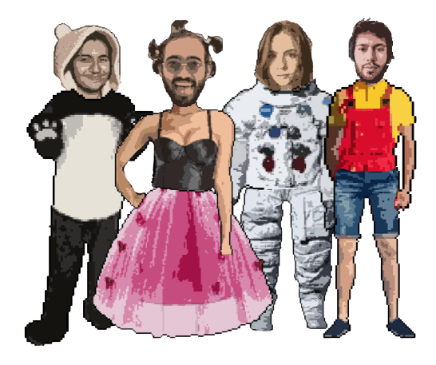

<p align="center">
    
</p>

# NFT Marketplace for Ethereum Blockchain

NFT Suits is a game centered around collectible unique items that are used to create one-of-a-kind avatars where the uniqueness is guaranteed by ERC721 protocol.  No items can bereplicated, taken away, or destroyed, since the proof of ownerships are stored on Ethereum blockchain. In order to see the items and interact with the marketplace, user has to installMetaMask extension to her/his browser. Then, by connecting his/her wallet; the user can buy, bid on, offer items for auction and sell the items via the marketplace. As tree requiredand complementary pieces are purchased and worn, an avatar is created and displayed to the community.

## Authors

- [@cavitcakir](https://www.github.com/cavitcakir)
- [@kayakapagan](https://www.github.com/kayakapagan)
- [@gorkemkose](https://www.github.com/gorkemkose)
- [@gokberkyar](https://www.github.com/gokberkyar)

<p align="center">
    
</p>

## Tech Stack

**Client:** React, Recoil, Material UI

**Contract:** Solidity

**Dev Tools:** Ganache, Truffle, Remix, Docker

**Static Smart Contract Analysis:** Securify 2.0, Slither

**Testing:** Mocha

<p align="center">
    <code></code>
    <code></code>
    <code></code>
    <code></code>
    <code></code>
    <code></code>
    <code></code>
    <code></code>
    <code></code>
    <code></code>
    <code></code>
</p>

## Deliverables
   - [website (make sure you are in Ropsten Test Network)](https://nftsuits.com/)
   - [report](https://github.com/cs48kblockchain/NFTSuits-DApp/blob/main/NFTSuitsExplained.pdf)
   - [presentation](https://github.com/cs48kblockchain/NFTSuits-DApp/blob/main/Presentation.pdf)

## Features

### Within her/his profile, a user can

- Set a username
- Withdraw her/his balance
- Create an avatar with the items that (s)he owns by wearing
- Save the item and display it in the avatars page
- List his/her items with certain filtering options
- See his/her statistics

### Within the item page, a user can

- Sell her/his item for a fixed price
- Cancel sale for his/her item
- Buy an item
- Create an auction for his/her item
- Cancel an auction for his/her item
- Accept the highest bid
- Bid on an item
- Withdraw his/her bid
- Wear his/her item under some condition
- Unwear his/her item under some condition
- List all of the items with certain filtering options
 
## How to Run Docker

```bash
    ## in project directory, i.e. cd project
    docker-compose -f docker-compose.dev.yml up
```

## Running Tests
To run tests, run the following command

```bash
  ## make sure ganache is running
  cd truffle
  truffle test
```

## Screenshots
<p align="center">
    <h3>Landing Page</h3>
    
</p>
<p align="center">
    <h3>Market Place</h3>
    
</p>
<p align="center">
    <h3>Item Page Example 1</h3>
    
</p>
<p align="center">
    <h3>Item Page Example 2</h3>
    
</p>
<p align="center">
    <h3>Profile Page</h3>
    
</p>
<p align="center">
    <h3>Avatars Page</h3>
    
</p>

## Support and Feedback

Feel free to create an issue to discuss more.

  


